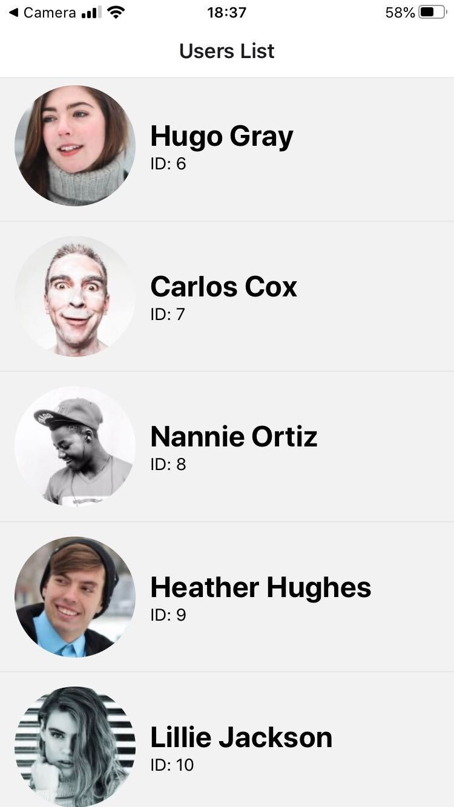

# React Native Expo facelist

This simple app shows a list of people with their avatars and names.

## User service

### Running the application

1. Go to `packages/service`.
2. Install dependencies via `yarn`.
3. Run the service via `yarn start`. It will expose a `/users` endpoint on port `3000` by default.

### Architecture

The project was seeded with https://github.com/seanpmaxwell/express-generator-typescript and adapted to the current structure.

The approach is to modularize the project around domain terms.
DAOs, routes, tests etc. for a given part of the project are grouped in the relevant directory.

Each directory exports an `index.ts` file serving as the main point of integrating the module with the application.
The use of this is to allow injecting dependencies and configuring modules from the top level.

For the purpose of this task there isn't much configuration happening, so this serves more as a demonstration of the train of thought.

#### Data

As data is not part of the source, I moved it out to a separate directory and use `path.resolve` to refer to its location.

## Client application

### Running the application

1. Go to `packages/app`.
2. Make sure to have the correct URL to your service in [shared/config.ts](./packages/app/shared/config.ts).
3. Install dependencies via `yarn`.
4. Run the expo console via `yarn start` and follow instructions therein.

### Architecture

The codebase is organized similarly to the service package.
The application domain drives the file structure to be able to move things around easily if need be.

The `users` module exposes elements necessary to run it via its `index` barrel file.

### Testing

I implemented tests on 3 levels:

1. Unit testing the effects of actions on the state in [usersReducer.test.ts](./packages/app/src/users/usersReducer.test.ts).
2. Snapshots for UI components. The snapshots are quite verbose right now as I opted for simplicity. In a production setting this can of course be amended to keep the tests more focused.
3. Testing the connection between the container and store in [UsersListContainer.test.tsx](./packages/app/src/users/components/UsersListContainer.test.tsx).

#### Caveat

Due to having the `useEffect` call put directly into the `UsersListContainer` there is an issue with the related tests and timing.
The simplest solution to solve this issue is to create a `UsersListScreen` component that would take care of the initial behavior and render the `UsersListContainer`.
